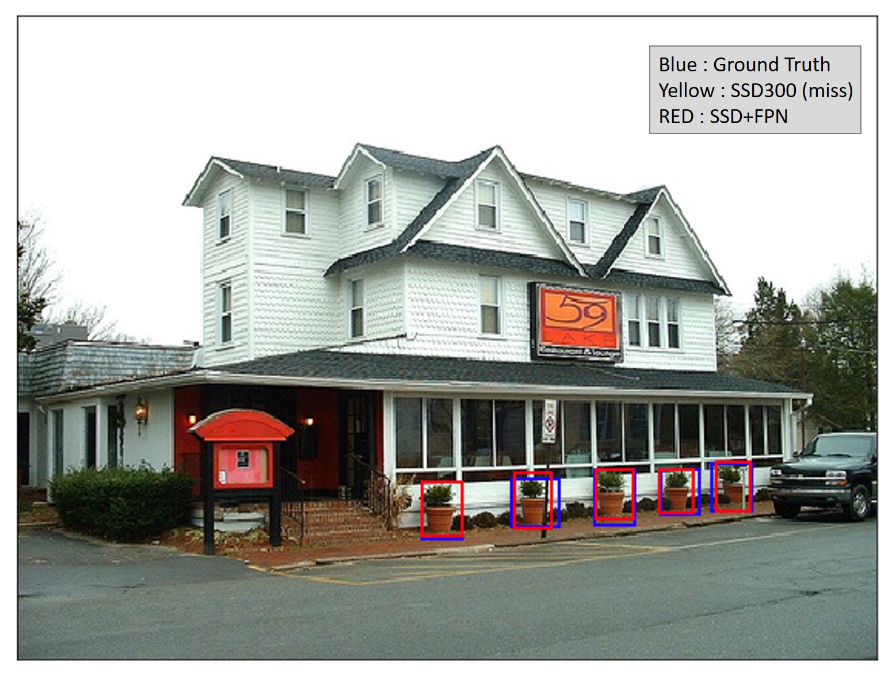

# SSD-FPN
Improve detection performance of [SSD(Single Shot MultiBox Detector)](http://arxiv.org/abs/1512.02325) by adding FPN module.
| SSD-300 | SSD-300+FPN-38 | SSD-300+FPN-75 | SSD-300+FPN-150 |
|:-:|:-:|:-:|:-:|
| 77.4 % | 78.45 % | 78.95% | 79.03 % |

Note: The SSD code is modified from https://github.com/aa10402tw/ssd.pytorch.

## Model Architecture
 
 

## Example
 
 